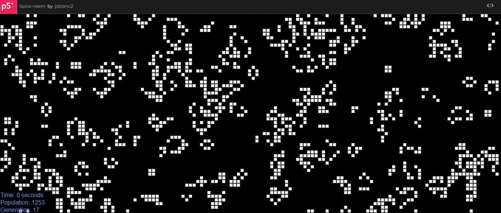

# Conway's Game of Life Simulation

This project is a simple implementation of Conway's Game of Life using p5.js, a JavaScript library for creative coding. The Game of Life is a cellular automaton devised by mathematician John Conway, where each cell in a grid evolves based on a set of simple rules.

## Demo
<br>

## Getting Started

1. Clone the repository:

   ```bash
   git clone https://github.com/jcblanc2/Game-of-Life.git
   cd Game-of-Life
   ```

2. Open `index.html` in a web browser or use a local server to run the simulation.

## Features

- Random initialization of the grid with alive and dead cells.
- Evolution of the grid according to the rules of Conway's Game of Life.
- Display of time elapsed, population count, and generation number.

## Usage

- **Starting the Simulation:**
  - Open `index.html` in a web browser.
  - The simulation will start with a randomly generated initial state.

- **Controls:**
  - No user controls implemented. The simulation evolves automatically.

## Customization

- Adjust `cellSize` variable in the script to change the size of each cell.
- Modify `createInitialState` function to customize the initial grid configuration.
